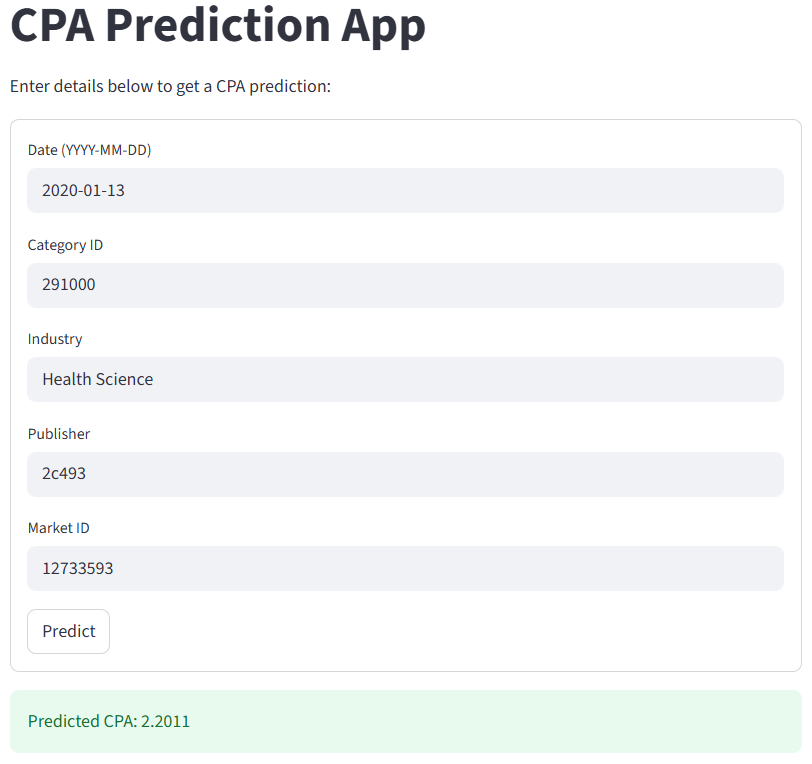
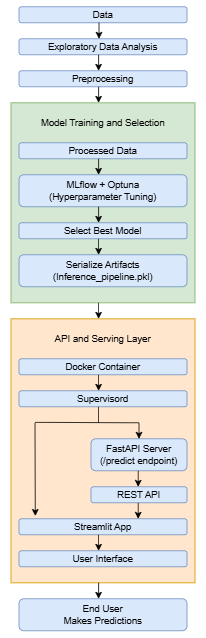

# CPA Prediction for Programmatic Recruitment Advertising

## Project Overview
This project develops a machine learning solution to predict the Cost Per Application (CPA) for programmatic recruitment advertising campaigns run by a company across multiple publishers, markets and job categories. The goal is to optimize campaign efficiency by predicting CPA and identifying key performance drivers. The project includes exploratory data analysis (EDA), data cleaning, feature engineering, model training with experiment tracking, an inference pipeline, a FastAPI-based API, a Streamlit UI and Docker containerization for deployment. All components are designed to be production-ready and showcase a robust end-to-end data science workflow.

### Business Problem
The company runs tailored advertising campaigns to generate job applications ("conversions") at a minimized CPA. Campaign performance varies due to factors like market (location), publisher (ad platform) and job category or industry. The challenge is to:
- **Predict CPA** outcomes before launching campaigns.
- **Understand drivers** of CPA performance to guide campaign decisions.
This project builds a CPA prediction model to optimize publisher, market and category selections.

### Dataset
The dataset (`data.csv`) contains daily campaign-level performance with the following columns:

| **Column**      | **Description**                          |
|------------------|------------------------------------------|
| date            | Date of the event                        |
| campaign_id     | Unique campaign identifier               |
| category_id     | Category assigned to the campaign        |
| industry        | Industry of the customer                 |
| customer_id     | Unique customer identifier               |
| publisher       | Platform or inventory source of the ad   |
| market_id       | Unique market (location) identifier      |
| cost            | Total cost incurred                      |
| clicks          | Total clicks received                    |
| conversions     | Total applications                       |

CPA is calculated as `cost / conversions`.

### Project Components
1. **Exploratory Data Analysis (EDA)** (`eda.ipynb`):
   - Visualized CPA distributions and performed statistical hypothesis testing using ANOVA (`f_oneway`) to validate differences.

   | **Visualization**                    | **ANOVA F-statistic** | **ANOVA p-value** | **Hypothesis (H0)**                  | **Insight**                                                                 |
   |--------------------------------------|-----------------------|-------------------|--------------------------------------|-----------------------------------------------------------------------------|
   | Publisher Choice Has Limited Impact on CPA Across Top 10 Platforms | 1.5092               | 0.1405            | No significant difference in CPA between publishers | <ul><li>Average CPA does not significantly differ among top 10 publishers.</li><li>Choosing one is unlikely to drastically reduce costs per application.</li></ul> |
   | Industry Type Does Not Significantly Affect CPA | 0.5120               | 0.8665            | No significant difference in CPA between industries | <ul><li>Average CPA is similar across industries (p-value = 0.87).</li><li>No industry consistently drives higher/lower costs.</li></ul> |
   | CPA is Consistent Across Customers   | 0.8001               | 0.7392            | No significant difference in CPA between customers | <ul><li>Average CPA does not differ significantly between customers (p-value = 0.74).</li><li>No customer drives higher/lower costs.</li></ul> |
   | CPA Varies Significantly Across Categories | 1.6100            | 0.0229            | Significant difference in CPA between categories | <ul><li>CPA differs significantly between categories (p-value = 0.023).</li><li>Some categories are more cost-efficient.</li></ul> |
   | Day of Week Has Minimal Impact on CPA| 1.3721               | 0.2231            | No significant difference in CPA between days      | <ul><li>Average CPA does not vary significantly across days (p-value = 0.22).</li><li>No day yields lower/higher costs.</li></ul> |
   | CPA Remains Stable Across Months     | 1.0830               | 0.3683            | No significant difference in CPA between months     | <ul><li>Average CPA shows no significant variation across months (p-value = 0.37).</li><li>No month drives costs.</li></ul> |
   | CPC Shows No Significant Difference Across Categories | 1.3918 | 0.0836            | No significant difference in CPC across categories  | <ul><li>Average CPC varies slightly by category but not significantly (p-value = 0.08).</li><li>No category consistently lowers/higher CPC.</li></ul> |

   - **Why Bar Plots?**
     | **Reason**              | **Details**                                                                 |
     |-------------------------|-----------------------------------------------------------------------------|
     | Comparing categories    | Bar plots directly compare averages across discrete groups (e.g., publishers, categories). |
     | Clarity & simplicity    | Familiar to stakeholders, easy to interpret without technical knowledge.    |
     | Highlighting magnitude  | Bar height shows performance differences clearly, aligning with insights.   |
     | Statistical complement  | Pairs with ANOVA for visual intuition and statistical rigor.                |
     - **Alternative Visualizations (Why not used?)**
       | **Type**            | **Reason**                              |
       |---------------------|-----------------------------------------|
       | Box/Violin plots    | Show spread but may overwhelm non-technical readers. |
       | Line charts         | Suitable for time series, not categorical comparisons. |
       | Scatter plots       | Best for continuous variable relationships, not the focus here. |

2. **Data Cleaning** (`data_preprocessing.ipynb`):
   - Removed rows where `cost = 0`, `clicks = 0`, and `conversions = 1` to exclude invalid campaign data with applications but no associated cost or clicks
   - Removed outliers and duplicates.
   - Checked for skewed data and applied transformations as needed.
   - Performed encoding (e.g., target encoding for categorical variables).
   - Scaled numerical features.
   - Conducted Kurtosis check for normality.
   - Created interaction terms and evaluated polynomial features using Ramsey's RESET Test.
   - Checked for multicollinearity using Variance Inflation Factor (VIF).

   #### Outlier Detection
   | **Aspect**                | **Details**                                                                 |
   |---------------------------|-----------------------------------------------------------------------------|
   | **Methods Tried**         | <ul><li>IsolationForest</li><li>Local Outlier Factor (LOF)</li><li>One-Class SVM</li><li>DBSCAN</li><li>Z-Score method</li></ul> |
   | **Evaluation on Validation Set** | <ul><li>IsolationForest consistently provided the best results, achieving the lowest cross-validated RMSE.</li><li>Followed by: <ul><li>Local Outlier Factor (LOF)</li><li>One-Class SVM</li><li>DBSCAN</li><li>Z-Score method</li></ul></li></ul> |
   | **Decision**              | The final model uses IsolationForest for outlier detection.                 |
   | **Takeaway**              | By systematically comparing multiple approaches and validating their impact on downstream performance, IsolationForest was selected as the outlier removal method, ensuring an empirically justified, robust, and interpretable preprocessing step. |

   #### Skewed Features
   | **Aspect**                | **Details**                                                                 |
   |---------------------------|-----------------------------------------------------------------------------|
   | **Methods Tried**         | <ul><li>Yeo-Johnson</li><li>Logarithmic (log)</li><li>Square Root (sqrt)</li><li>Box-Cox</li><li>Reciprocal</li><li>None</li></ul> |
   | **Evaluation on Validation Set** | <ul><li>Log transformation produced the best results.</li><li>Followed by: <ul><li>Yeo-Johnson</li><li>Box-Cox</li><li>Square Root (sqrt)</li><li>Reciprocal</li></ul></li></ul> |
   | **Decision**              | The final model used the log transformation on skewed features as it consistently reduced skewness and improved cross-validated RMSE. |
   | **Takeaway**              | This approach ensures that features are closer to a normal distribution which can improve model convergence, stability and overall predictive performance. |

   #### Encoding
   | **Aspect**                | **Details**                                                                 |
   |---------------------------|-----------------------------------------------------------------------------|
   | **Methods Tried**         | <ul><li>Target Encoding</li><li>Leave-One-Out (LOO) Encoding</li><li>Binary Encoding</li><li>Frequency Encoding</li><li>Label Encoding</li></ul> |
   | **Evaluation on Validation Set** | <ul><li>Target Encoding performed the best, providing the lowest cross-validated RMSE.</li><li>Followed by: <ul><li>Leave-One-Out (LOO) Encoding</li><li>Binary Encoding</li><li>Frequency Encoding</li><li>Label Encoding</li></ul></li></ul> |
   | **Decision**              | The final model uses Target Encoding for categorical variables.             |
   | **Takeaway**              | This method captures the relationship between categorical features and the target variable more effectively than other encodings which improves model performance, especially in regression tasks. |

   #### Scaling
   | **Aspect**                | **Details**                                                                 |
   |---------------------------|-----------------------------------------------------------------------------|
   | **Methods Tried**         | <ul><li>StandardScaler</li><li>RobustScaler</li><li>MinMaxScaler</li><li>MaxAbsScaler</li><li>QuantileTransformer</li><li>Normalizer</li><li>log1p</li></ul> |
   | **Evaluation on Validation Set** | <ul><li>StandardScaler achieved the best performance in terms of cross-validated RMSE.</li><li>Followed by: <ul><li>RobustScaler</li><li>MinMaxScaler</li><li>MaxAbsScaler</li><li>QuantileTransformer</li><li>Normalizer</li><li>log1p</li></ul></li></ul> |
   | **Decision**              | The final model uses StandardScaler for scaling numerical features.         |
   | **Takeaway**              | This approach standardizes features to have zero mean and unit variance which is generally effective for tree-based and gradient-boosting models in regression tasks. |

3. **Feature Engineering** (`feature_engineering.ipynb`):
   - Added features:

   | **Feature**          | **Description**                          |
   |-----------------------|------------------------------------------|
   | day_of_week          | Day of the week derived from date        |
   | month                | Month extracted from date                |
   | is_weekend           | Binary indicator for weekend days        |
   | publisher_avg_clicks | Average clicks per publisher             |
   | market_avg_clicks    | Average clicks per market                |
   | publisher_popularity | Popularity score of publisher            |
   | market_popularity    | Popularity score of market               |

   - Selected features using:

   | **Method**                        | **Reason**                              |
   |-----------------------------------|-----------------------------------------|
   | Pearson correlation with CPA      | Identifies linear relationships with target. |
   | Highly correlated feature pairs (>0.8) | Removes redundant features to avoid multicollinearity. |
   | Feature variance analysis         | Excludes low-variance features with little predictive power. |
   | Correlation-based feature selection | Enhances model performance by focusing on relevant features. |

4. **Modeling** (`modelling.py`):
   - Split data into train, validation and test sets for robust evaluation.
   - Used RepeatedKFold cross-validation to ensure reliable model performance assessment.
   - Used MLflow for experiment tracking and Optuna for hyperparameter optimization.
   - Evaluated multiple regression models:

   | **Model**              | **Source**            |
   |------------------------|-----------------------|
   | LinearSVR              | scikit-learn          |
   | HuberRegressor         | scikit-learn          |
   | BaggingRegressor       | scikit-learn          |
   | HistGradientBoostingRegressor | scikit-learn    |
   | NuSVR                  | scikit-learn          |
   | XGBoostRegressor       | XGBoost    |
   | LGBMRegressor          | LightGBM   |
   | VotingRegressor        | scikit-learn (Ensemble) |
   | StackingRegressor      | scikit-learn (Ensemble) |

   - Selected the best-performing model after hyperparameter tuning.
   - Debugged using:

   | **Method**                     | **Reason**                              |
   |--------------------------------|-----------------------------------------|
   | Learning curves                | Assesses model training and generalization. |
   | Feature interaction analysis with SHAP interaction values | Identifies feature interactions impacting predictions. |
   | Outlier inspection with SHAP values | Detects outliers influencing model output. |

   - Visualized model performance with:

   | **Visualization**         | **Reason**                              |
   |---------------------------|-----------------------------------------|
   | Actual vs. Predicted Plot | Compares predictions to actual values for accuracy. |
   | Residual Plot             | Checks for patterns in prediction errors. |
   | Q-Q Plot                  | Evaluates normality of residuals.       |
   | Bar Plot of Error Metrics | Displays error metrics for model assessment. |
   | Partial Dependence Plots (PDP) | Shows effect of features on predictions. |

   - MLflow UI for experiment tracking:

   <p align="center">
     
   </p>
5. **Inference Pipeline** (`inference.py`):
   - Built a pipeline with custom transformers and the final trained model for predictions.
   - Saved as `model.pkl` for reuse.
6. **API Server** (`server.py`):
   - FastAPI-based server exposing a `/predict` endpoint to return predicted CPA given campaign features.
7. **Streamlit App** (`app.py`):
   - Interactive UI for inputting campaign parameters and visualizing predicted CPA.
   - Streamlit UI screenshot:

   <p align="center">
     
   </p>
8. **Docker Container** (`Dockerfile`, `supervisord.conf`):
   - Containerizes the FastAPI server and Streamlit app.
   - Uses `supervisord` to manage communication between the API and Streamlit UI.
9. **Project Architecture Diagram** (`architecture_diagram.PNG`):
   - Visualizes the workflow from data ingestion to deployment.

### Project Architecture

<p align="center">
  
</p>

The architecture diagram illustrates the end-to-end workflow of the CPA prediction project:

- **Data**: The process begins with the raw dataset (`data.csv`) serving as the foundation for analysis.
- **Exploratory Data Analysis**: Initial exploration and visualization uncover patterns and insights.
- **Preprocessing**: Data is cleaned, encoded and transformed to prepare it for modeling.
- **Model Training and Selection**: 
  - Processed data is used to train models.
  - MLflow and Optuna facilitate hyperparameter tuning and experiment tracking.
  - The best model is selected based on performance metrics.
  - The final model and inference pipeline are serialized as artifacts (`inference_pipeline.pkl`).
- **API and Serving Layer**: 
  - A Docker container encapsulates the serving environment.
  - Supervisord manages the FastAPI server (with a `/predict` endpoint) and Streamlit app.
  - The FastAPI server exposes a REST API for predictions.
  - The Streamlit app provides an interactive user interface.
- **User Interface**: End users interact with the Streamlit app to input campaign parameters and receive predictions.
- **End User**: The workflow concludes with the end user making informed predictions based on the model's output.

This architecture ensures a scalable, reproducible and user-friendly solution for CPA prediction.

### Setup Instructions
#### Prerequisites
- Python 3.8+
- Docker
- Required packages (listed in `requirements.txt`)

#### Installation
1. Clone the repository:
   ```bash
   git clone https://github.com/samir-gaykar/cpa-prediction-app.git
   cd cpa-prediction-app
   ```
2. Install dependencies:
   ```bash
   pip install -r requirements.txt
   ```
3. Download the dataset (`data.csv`) from the `data/` folder.

#### Running the Project
1. **EDA and Data Cleaning**:
   - Open `eda.ipynb` and `data_preprocessing.ipynb` in Jupyter Notebook.
2. **Train the Model**:
   ```bash
   python modelling.py
   ```
   - Outputs `model.pkl` and logs experiments to MLflow.
3. **Run the API Server**:
   ```bash
   python server.py
   ```
   - Access at `http://localhost:8000/predict` (POST request).
4. **Run the Streamlit App**:
   ```bash
   streamlit run app.py
   ```
   - Access at `http://localhost:8501`.
5. **Run with Docker**:
   ```bash
   docker build -t cpa-prediction-app .
   docker run -p 8000:8000 -p 8501:8501 cpa-prediction-app
   ```
   - API at `http://localhost:8000`, Streamlit at `http://localhost:8501`.

#### Example API Request
```bash
curl -X POST "http://localhost:8000/predict" -H "Content-Type: application/json" -d '{"date": "2020-01-13", "category_id": "291000", "industry": "Health Science", "publisher": "2c493", "market_id": "12733593", }'
```
Response: `{"predicted_cpa": 2.2011}`

### Key Features
- **Robust EDA**: Statistical tests (ANOVA) and visualizations uncover CPA drivers.
- **Advanced Feature Engineering**: Derived features enhance model performance.
- **Comprehensive Modeling**: RepeatedKFold cross-validation and train/validation/test splits ensure robust evaluation. Experiment tracking with MLflow and hyperparameter tuning with Optuna.
- **Explainability**: SHAP values and visualizations provide insights into model decisions.
- **Production-Ready**: FastAPI, Streamlit and Docker ensure scalability and usability.
- **Interactive UI**: Streamlit app for easy campaign scenario testing.

### Results
- Identified high-performing publishers, markets and categories using EDA and SHAP analysis.
- Achieved accurate CPA predictions with the tuned model.
- Streamlit UI enables intuitive campaign optimization.

### Repository Structure
```
cpa-prediction-app/
│
├── data/                          
│   └── data.csv					# Dataset for CPA prediction
│
├── notebooks/						# Jupyter notebooks for experimentation
│   ├── 01_eda.ipynb				# Exploratory data analysis
│   ├── 02_data_preprocessing.ipynb	# Data cleaning and preprocessing
│   ├── 03_modelling.ipynb			# Model training and evaluation
│   └── 04_inference_pipeline.ipynb	# Inference pipeline development
│
├── src/							# Core source code
│   ├── app.py 						# Streamlit app for UI
│   └── server.py 					# FastAPI server for API endpoint
│ 
│
├── configs/						# Config files
│   └── supervisord.conf 			# Supervisord configuration for Docker
│
├── assets/							# Images for README
│   ├── streamlit_ui.PNG 			# Streamlit UI screenshot
│   ├── mlflow_ui.PNG 				# MLflow UI screenshot
│   └── architecture_diagram.PNG 	# Project architecture diagram
│
├── Dockerfile						# Docker configuration for containerization
├── requirements.txt				# Python dependencies
└── README.md 						# Project overview and instructions
```

### Additional Notes
- **MLflow Tracking**: Experiments are logged for reproducibility (see `assets/mlflow_ui.PNG`).
- **Model Debugging**: SHAP values and learning curves ensure robust model performance.
- **Scalability**: Docker and supervisord enable seamless deployment.

### Future Improvements
- Integrate real-time data feeds for dynamic predictions.
- Explore deep learning models for complex patterns.

### Contact
For questions or feedback, reach out via GitHub Issues or [gaykarsamiry@gmail.com].
