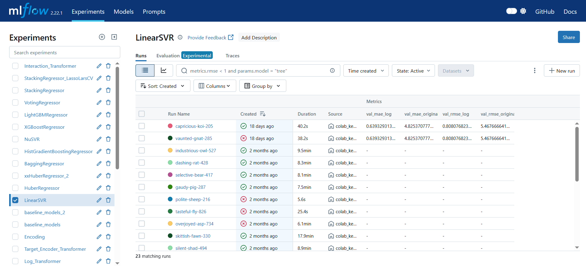

# CPA Prediction for Programmatic Recruitment Advertising

## Project Overview
This project develops a machine learning solution to predict the Cost Per Application (CPA) for programmatic recruitment advertising campaigns run by a company across multiple publishers, markets and job categories. The goal is to optimize campaign efficiency by predicting CPA and identifying key performance drivers. The project includes exploratory data analysis (EDA), data cleaning, feature engineering, model training with experiment tracking, an inference pipeline, a FastAPI-based API, a Streamlit UI and Docker containerization for deployment. All components are designed to be production-ready and showcase a robust end-to-end data science workflow.

### Business Problem
The company runs tailored advertising campaigns to generate job applications ("conversions") at a minimized CPA. Campaign performance varies due to factors like market (location), publisher (ad platform) and job category or industry. The challenge is to:
- **Predict CPA** outcomes before launching campaigns.
- **Understand drivers** of CPA performance to guide campaign decisions.
This project builds a CPA prediction model to optimize publisher, market and category selections.

### Dataset
The dataset (`data.csv`) contains daily campaign-level performance with the following columns:
- **date**: Date of the event
- **campaign_id**: Unique campaign identifier
- **category_id**: Category assigned to the campaign
- **industry**: Industry of the customer
- **customer_id**: Unique customer identifier
- **publisher**: Platform or inventory source of the ad
- **market_id**: Unique market (location) identifier
- **cost**: Total cost incurred
- **clicks**: Total clicks received
- **conversions**: Total applications

CPA is calculated as `cost / conversions`.

### Project Components
1. **Exploratory Data Analysis (EDA)** (`eda.ipynb`):
   - Visualized CPA distributions across:
     - Top 10 publishers
     - Industries
     - Customer segments
     - Categories (ascending order)
     - Day of the week
     - Month
     - Cost per click
   - Performed statistical hypothesis testing using ANOVA (`f_oneway`) to validate differences in CPA across these groups.
2. **Data Cleaning** (`data_preprocessing.ipynb`):
   - Removed outliers and duplicates.
   - Checked for skewed data and applied transformations as needed.
   - Performed encoding (e.g., target encoding for categorical variables).
   - Scaled numerical features.
   - Conducted Kurtosis check for normality.
   - Created interaction terms and evaluated polynomial features using Ramsey's RESET Test.
   - Checked for multicollinearity using Variance Inflation Factor (VIF).
3. **Feature Engineering** (`feature_engineering.ipynb`):
   - Added features: `day_of_week`, `month`, `is_weekend`, `publisher_avg_clicks`, `market_avg_clicks`, `publisher_popularity`, `market_popularity`.
   - Selected features using:
     - Pearson correlation with CPA
     - Identification of highly correlated feature pairs (>0.8)
     - Feature variance analysis
     - Correlation-based feature selection
4. **Modeling** (`modelling.py`):
   - Split data into train, validation and test sets for robust evaluation.
   - Used RepeatedKFold cross-validation to ensure reliable model performance assessment.
   - Used MLflow for experiment tracking and Optuna for hyperparameter optimization.
   - Evaluated multiple regression models from scikit-learn (LinearSVR, HuberRegressor, BaggingRegressor, HistGradientBoostingRegressor, NuSVR) and external libraries (XGBoostRegressor, LGBMRegressor), plus ensemble methods (VotingRegressor, StackingRegressor).
   - Selected the best-performing model after hyperparameter tuning.
   - Debugged using:
     - Learning curves
     - Feature interaction analysis with SHAP interaction values
     - Outlier inspection with SHAP values
   - Visualized model performance with:
     - Actual vs. Predicted Plot
     - Residual Plot
     - Q-Q Plot
     - Bar Plot of Error Metrics
     - Partial Dependence Plots (PDP)
   - MLflow UI for experiment tracking:
     
5. **Inference Pipeline** (`inference.py`):
   - Built a pipeline with custom transformers and the final trained model for predictions.
   - Saved as `model.pkl` for reuse.
6. **API Server** (`server.py`):
   - FastAPI-based server exposing a `/predict` endpoint to return predicted CPA given campaign features.
7. **Streamlit App** (`app.py`):
   - Interactive UI for inputting campaign parameters and visualizing predicted CPA.
   - Streamlit UI screenshot:
     
8. **Docker Container** (`Dockerfile`, `supervisord.conf`):
   - Containerizes the FastAPI server and Streamlit app.
   - Uses `supervisord` to manage communication between the API and Streamlit UI.
9. **Project Architecture Diagram** (`architecture_diagram.PNG`):
   - Visualizes the workflow from data ingestion to deployment.

### Project Architecture


The architecture diagram illustrates the end-to-end workflow of the CPA prediction project:

- **Data**: The process begins with the raw dataset (`data.csv`) serving as the foundation for analysis.
- **Exploratory Data Analysis**: Initial exploration and visualization uncover patterns and insights.
- **Preprocessing**: Data is cleaned, encoded and transformed to prepare it for modeling.
- **Model Training and Selection**: 
  - Processed data is used to train models.
  - MLflow and Optuna facilitate hyperparameter tuning and experiment tracking.
  - The best model is selected based on performance metrics.
  - The final model and inference pipeline are serialized as artifacts (`inference_pipeline.pkl`).
- **API and Serving Layer**: 
  - A Docker container encapsulates the serving environment.
  - Supervisord manages the FastAPI server (with a `/predict` endpoint) and Streamlit app.
  - The FastAPI server exposes a REST API for predictions.
  - The Streamlit app provides an interactive user interface.
- **User Interface**: End users interact with the Streamlit app to input campaign parameters and receive predictions.
- **End User**: The workflow concludes with the end user making informed predictions based on the model's output.

This architecture ensures a scalable, reproducible and user-friendly solution for CPA prediction.

### Setup Instructions
#### Prerequisites
- Python 3.8+
- Docker
- Required packages (listed in `requirements.txt`)

#### Installation
1. Clone the repository:
   ```bash
   git clone https://github.com/samir-gaykar/cpa-prediction-app.git
   cd cpa-prediction-app
   ```
2. Install dependencies:
   ```bash
   pip install -r requirements.txt
   ```
3. Download the dataset (`data.csv`) from the `data/` folder.

#### Running the Project
1. **EDA and Data Cleaning**:
   - Open `eda.ipynb` and `data_preprocessing.ipynb` in Jupyter Notebook.
2. **Train the Model**:
   ```bash
   python modelling.py
   ```
   - Outputs `model.pkl` and logs experiments to MLflow.
3. **Run the API Server**:
   ```bash
   python server.py
   ```
   - Access at `http://localhost:8000/predict` (POST request).
4. **Run the Streamlit App**:
   ```bash
   streamlit run app.py
   ```
   - Access at `http://localhost:8501`.
5. **Run with Docker**:
   ```bash
   docker build -t cpa-prediction-app .
   docker run -p 8000:8000 -p 8501:8501 cpa-prediction-app
   ```
   - API at `http://localhost:8000`, Streamlit at `http://localhost:8501`.

#### Example API Request
```bash
curl -X POST "http://localhost:8000/predict" -H "Content-Type: application/json" -d '{"date": "2020-01-13", "category_id": "291000", "industry": "Health Science", "publisher": "2c493", "market_id": "12733593", }'
```
Response: `{"predicted_cpa": 2.2011}`

### Key Features
- **Robust EDA**: Statistical tests (ANOVA) and visualizations uncover CPA drivers.
- **Advanced Feature Engineering**: Derived features enhance model performance.
- **Comprehensive Modeling**: RepeatedKFold cross-validation and train/validation/test splits ensure robust evaluation. Experiment tracking with MLflow and hyperparameter tuning with Optuna.
- **Explainability**: SHAP values and visualizations provide insights into model decisions.
- **Production-Ready**: FastAPI, Streamlit and Docker ensure scalability and usability.
- **Interactive UI**: Streamlit app for easy campaign scenario testing.

### Results
- Identified high-performing publishers, markets and categories using EDA and SHAP analysis.
- Achieved accurate CPA predictions with the tuned model.
- Streamlit UI enables intuitive campaign optimization.

### Repository Structure
```
cpa-prediction-app/
│
├── data/                          
│   └── data.csv					# Dataset for CPA prediction
│
├── notebooks/						# Jupyter notebooks for experimentation
│   ├── 01_eda.ipynb				# Exploratory data analysis
│   ├── 02_data_preprocessing.ipynb	# Data cleaning and preprocessing
│   ├── 03_modelling.ipynb			# Model training and evaluation
│   └── 04_inference_pipeline.ipynb	# Inference pipeline development
│
├── src/							# Core source code
│   ├── app.py 						# Streamlit app for UI
│   ├── server.py 					# FastAPI server for API endpoint
│ 
│
├── configs/						# Config files
│   └── supervisord.conf 			# Supervisord configuration for Docker
│
├── assets/							# Images for README
│   ├── streamlit_ui.PNG 			# Streamlit UI screenshot
│   ├── mlflow_ui.PNG 				# MLflow UI screenshot
│   └── architecture_diagram.PNG 	# Project architecture diagram
│
├── Dockerfile						# Docker configuration for containerization
├── requirements.txt				# Python dependencies
├── README.md 						# Project overview and instructions
```

### Additional Notes
- **MLflow Tracking**: Experiments are logged for reproducibility (see `assets/mlflow_ui.PNG`).
- **Model Debugging**: SHAP values and learning curves ensure robust model performance.
- **Scalability**: Docker and supervisord enable seamless deployment.

### Future Improvements
- Integrate real-time data feeds for dynamic predictions.
- Explore deep learning models for complex patterns.
- Enhance Streamlit UI with additional visualizations (e.g., SHAP plots).

### Contact
For questions or feedback, reach out via GitHub Issues or [gaykarsamiry@gmail.com].